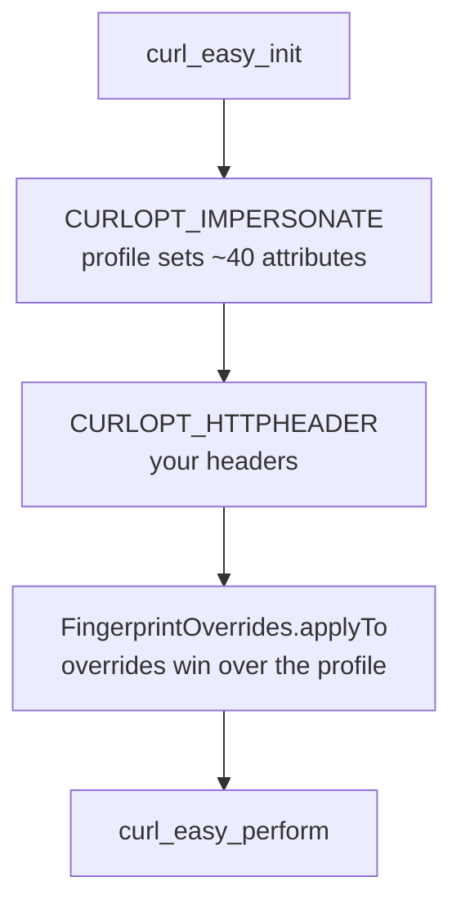

# Fingerprint tuning

`curl_impersonate_dart` bundles **libcurl-impersonate v2.2.2**. A profile such as
`BrowserProfile.chrome150` sets roughly forty TLS and HTTP/2 attributes in one
call. Since v2.0.0 those attributes are individually addressable, so you can
override just the ones you need.

This document covers what each option does, how to use it, and which of them are
actually useful when scraping.

---

## How it works



Two rules follow from that ordering:

1. **Overrides always beat the profile.** Setting `grease: false` on
   `chrome150` removes TLS GREASE even though the profile enables it.
2. **Overrides are applied after your headers are set**, which matters —
   `httpHeaderOrder` is meaningless before `CURLOPT_HTTPHEADER` exists.

```dart
final client = CurlImpersonateClient(
  defaultImpersonate: BrowserProfile.chrome150,
  overrides: const FingerprintOverrides(
    grease: false,
    certCompression: 'brotli',
  ),
);
```

Per-request patches layer over client defaults via `merge`, which is
non-destructive — the receiver is never mutated:

```dart
await client.request(
  url: url,
  method: 'GET',
  requestOverrides: const FingerprintOverrides(grease: true),
);
```

---

## The one rule that matters

**A fingerprint is scored as a whole.** Detection systems compare the
*combination* of TLS extensions, cipher order, extension permutation, HTTP/2
SETTINGS, header order and pseudo-header order against the set of values real
browsers actually produce.

Changing one attribute to a value no real browser emits does not make you look
less like a bot. It makes you look like something that is *not a browser*, which
is a much easier class to detect.

So the correct order of operations is:

1. **Pick the right profile first.** The profiles are maintained against real
   captures. If `chrome150` exists, use it.
2. **Reach for overrides only when you have a reason** — a specific capture to
   match, a target browser build that has no profile, or a behavioural need.
3. **Verify against a fingerprint echo service** (see [Verifying](#verifying)).

---

## Option reference

### Master profile

| Option | Code | Type | Meaning |
|---|---|---|---|
| `IMPERSONATE` | 10999 | string | Target as `"name[:yes|no]"`; the suffix controls whether the profile contributes default browser headers |

In this package the profile is normally selected with `BrowserProfile.*`. To take
over the header set yourself:

```dart
CurlImpersonateClient(
  defaultImpersonate: BrowserProfile.chrome131Android,
  impersonateDefaultHeaders: false,   // profile stops injecting its own headers
)
```

| Option | Code | Type | Meaning |
|---|---|---|---|
| `HTTPBASEHEADER` | 11000 | slist | Headers attributed to the *browser* rather than your code; merged with `HTTPHEADER` |

### TLS ClientHello

| Option | Code | Type | Meaning |
|---|---|---|---|
| `sigHashAlgs` | 11001 | string | `signature_algorithms` extension, e.g. `'rsa_pss_rsae_sha256 sha256'` |
| `enableAlps` | 1002 | bool | Advertise ALPS (draft-vvv-tls-alps) |
| `certCompression` | 11003 | string | Cert compression: `zlib`, `brotli` (RFC 8879) |
| `enableTicket` | 1004 | bool | TLS session ticket extension (RFC 5077) |
| `permuteExtensions` | 1007 | bool | BoringSSL extension permutation |
| `grease` | 1011 | bool | Emit TLS GREASE values |
| `extensionOrder` | 11012 | string | Comma-separated TLS extension order |
| `keyUsageCheck` | 1014 | bool | Perform the key-usage check |
| `signedCertTimestamps` | 1015 | bool | SCT extension |
| `statusRequest` | 1016 | bool | OCSP status request extension |
| `delegatedCredentials` | 11017 | string | Firefox delegated credentials |
| `recordSizeLimit` | 1018 | int | Firefox `record_size_limit` |
| `keySharesLimit` | 1019 | int | Firefox `key_shares_limit` |
| `useNewAlpsCodepoint` | 1020 | bool | Newer ALPS codepoint |
| `trustAnchors` | 11040 | string | Comma-separated trust-anchor relative OIDs (Chrome 152) |

> `keyUsageCheck` is the **inverse** of upstream's `TLS_KEY_USAGE_NO_CHECK`. The
> Dart field reads the way a caller thinks about it; the inversion happens on the
> way down. This is deliberate — the alternative was a footgun.

### HTTP/2

| Option | Code | Type | Meaning |
|---|---|---|---|
| `http2PseudoHeadersOrder` | 11005 | string | Permutation of `masp` → `:method :authority :scheme :path` |
| `http2Settings` | 11006 | string | SETTINGS frame, `id:value;id:value` |
| `http2WindowUpdate` | 1008 | int | Initial window update |
| `http2Streams` | 11010 | string | Initial stream count |
| `http2NoPriority` | 1021 | bool | Omit the HEADERS-frame priority bit |
| `streamExclusive` | 1013 | int | Stream exclusiveness (0/1) |

### Header ordering

| Option | Code | Type | Meaning |
|---|---|---|---|
| `httpHeaderOrder` | 11030 | string | Comma-separated order for ordinary headers |

Header order is a strong signal. Browsers send headers in a fixed, browser-specific
sequence, and curl's default alphabetical order is not it.

### Cookies, forms, proxy

| Option | Code | Type | Meaning |
|---|---|---|---|
| `splitCookies` | 1023 | bool | One `Cookie` header per cookie instead of a joined header |
| `formBoundary` | 11024 | string | multipart/form-data boundary style |
| `proxyCredentialNoReuse` | 1022 | bool | Don't reuse TLS sessions/connections across proxy credentials |

### HTTP/3 & QUIC

| Option | Code | Type | Meaning |
|---|---|---|---|
| `http3PseudoHeadersOrder` | 11025 | string | As HTTP/2, for HTTP/3 |
| `http3Settings` | 11026 | string | HTTP/3 SETTINGS frame |
| `quicTransportParameters` | 11027 | string | QUIC transport params, `id:value;id:value` |
| `http3SigHashAlgs` | 11028 | string | Sig algs for QUIC, overriding `sigHashAlgs` |
| `http3ExtensionOrder` | 11029 | string | Extension order for QUIC |
| `http3Headers` | 11031 | slist | Headers for HTTP/3 instead of `HTTPHEADER` |
| `http3HeaderOrder` | 11032 | string | Header order for HTTP/3 |
| `http3EcCurves` | 11033 | string | EC curves for HTTP/3 |
| `quicCidLength` | 11038 | string | QUIC initial connection ID length profile |
| `quicInitialPacketNumber` | 1041 | int | `-1` = Firefox randomized, else fixed |
| `http3PermuteExtensions` | 1039 | int | `-1` inherit `permuteExtensions`, 0 off, 1 on |

### WebSocket

| Option | Code | Type | Meaning |
|---|---|---|---|
| `wsHeaders` | 11034 | slist | Headers for `ws://`/`wss://` |
| `wsHeaderOrder` | 11035 | string | Header order for WebSockets |
| `wsDisableTicket` | 1036 | bool | Suppress the WS session-ticket extension |
| `wsCertCompression` | 11037 | string | Cert compression for WS |

---

## Scraping scenarios

### 1. A browser rotated and the old profile got flagged

The most common failure, and the one where overrides are the *wrong* tool.

```dart
// Wrong — hand-tuning a stale profile produces a fingerprint no browser has.
CurlImpersonateClient(
  defaultImpersonate: BrowserProfile.chrome142,
  overrides: const FingerprintOverrides(grease: true, enableAlps: true),
);

// Right — move to a maintained profile.
CurlImpersonateClient(defaultImpersonate: BrowserProfile.chrome150);
```

Profiles exist because upstream tracks real browser releases. Rotating to the
newest profile is always preferable to synthesising one.

### 2. Matching a specific browser build with no profile

Cloudflare and Akamai both score HTTP/2 as heavily as TLS. If you must present as
a particular build, override the HTTP/2 and header-order attributes **together** —
they are scored as a set, so changing one alone makes things worse.

```dart
final client = CurlImpersonateClient(
  defaultImpersonate: BrowserProfile.chrome150,
  overrides: FingerprintOverrides(
    http2Settings: FingerprintOverrides.formatSettings({
      1: 65536,   // HEADER_TABLE_SIZE
      2: 0,       // ENABLE_PUSH
      4: 6291456, // INITIAL_WINDOW_SIZE
      6: 100,     // MAX_HEADER_LIST_SIZE
    }),
    http2PseudoHeadersOrder: 'masp',
    http2WindowUpdate: 15663105,
    httpHeaderOrder: 'sec-ch-ua,sec-ch-ua-mobile,sec-ch-ua-platform,'
        'upgrade-insecure-requests,user-agent,accept,sec-fetch-site,'
        'sec-fetch-mode,sec-fetch-dest,sec-fetch-user,accept-encoding,'
        'accept-language,referer',
  ),
);
```

Take those values from a capture of the target build, not from this snippet.

### 3. Your own headers, browser-consistent TLS

Common when you need a custom `User-Agent` or an API key header but still want a
genuine TLS fingerprint. Turn off the profile's default headers and supply your
own:

```dart
final client = CurlImpersonateClient(
  defaultImpersonate: BrowserProfile.chrome131Android,
  impersonateDefaultHeaders: false,
);

await client.request(
  url: url,
  method: 'GET',
  headers: {
    'user-agent': 'Mozilla/5.0 (Linux; Android 14) ... Chrome/131 ...',
    'sec-ch-ua-platform': '"Android"',
    'accept': 'text/html,...',
  },
);
```

`chrome131Android` and desktop Chrome share a TLS fingerprint — only `User-Agent`
and `sec-ch-ua-platform` differ. That makes this the intended way to impersonate
a platform without touching TLS at all.

### 4. Cookie behaviour that trips a WAF

Some sites reject requests carrying many cookies in one joined header.

```dart
overrides: const FingerprintOverrides(splitCookies: true)
```

Use with care — Firefox sends split cookies, Chrome does not. Match the profile
you claim to be.

### 5. HTTP/3-only or QUIC-sensitive endpoints

Only four profiles carry HTTP/3 fingerprints: `chrome145`, `chrome146`,
`chrome150`, `firefox147` (see `BrowserProfile.supportsHttp3`).

```dart
final client = CurlImpersonateClient(
  defaultImpersonate: BrowserProfile.chrome150,
  overrides: FingerprintOverrides(
    http3Settings: FingerprintOverrides.formatSettings({1: 100, 6: 100, 7: 100}),
    quicInitialPacketNumber: -1,   // Firefox randomized distribution
  ),
);
```

Do not reach for these on an HTTP/1.1 or HTTP/2-only endpoint — they are inert
there, and a mismatched H2/H3 pair is its own signal.

### 6. WebSocket feeds

Live price ticks, chat, notifications.

```dart
await client.request(
  url: 'wss://stream.example/ws',
  method: 'GET',
  requestOverrides: FingerprintOverrides(
    wsHeaders: ['sec-websocket-version: 13', 'origin: https://example.com'],
    wsHeaderOrder: 'host,upgrade,connection,sec-websocket-key,'
        'sec-websocket-version,origin',
  ),
);
```

---

## Pitfalls

- **Do not enable GREASE or ALPS by default.** They are version-specific. Chrome
  has used both in sequence; blindly enabling them on a profile that omits them
  is a mismatch.
- **`certCompression` must be one of `zlib`, `brotli`.** Arbitrary strings are
  ignored or produce a malformed ClientHello.
- **`http2PseudoHeadersOrder` is a permutation of `masp`**, not a header name
  list. Safari and Firefox order these differently from Chrome.
- **Integer options are not booleans.** `http3PermuteExtensions: -1` means
  "inherit", distinct from `false`.
- **Overrides cannot fix a mismatched `User-Agent`.** Headers are the dominant
  signal for most providers; see scenario 3.
- **Settings values are versioned.** HTTP/2 SETTINGS ids and QUIC transport
  parameter ids are IANA registries — confirm the ones you emit are current.

---

## Verifying

Never ship a tuned fingerprint without checking it against an echo service:

| Service | Shows |
|---|---|
| `tls.browserleaks.com/json` | JA3/JA4, TLS extensions, ALPN, cert compression |
| `browserleaks.com/http2` | HTTP/2 SETTINGS, window update, header order |
| Akamai's bot-manager fingerprint endpoint | The full HTTP/2 + header score |

Compare the output against a real browser of the version you claim to be, not
against your expectations. Where a field diverges, that field is the override to
change — and only that field.